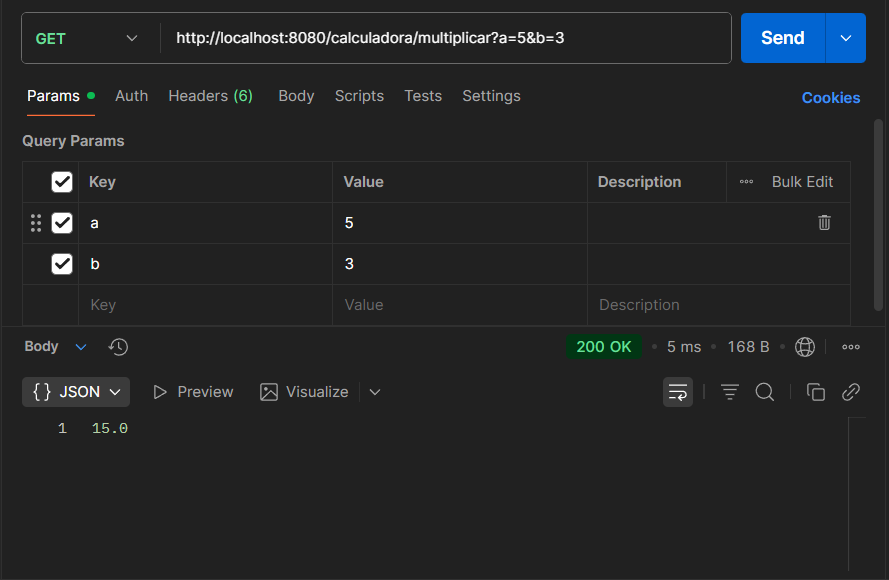
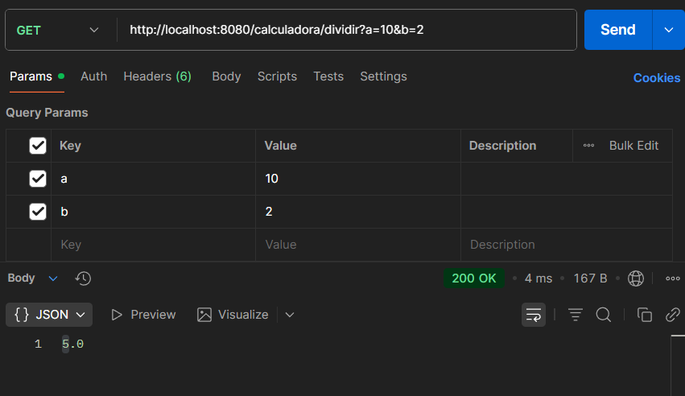
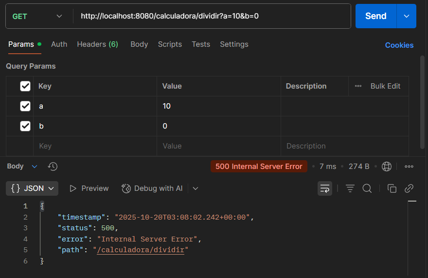
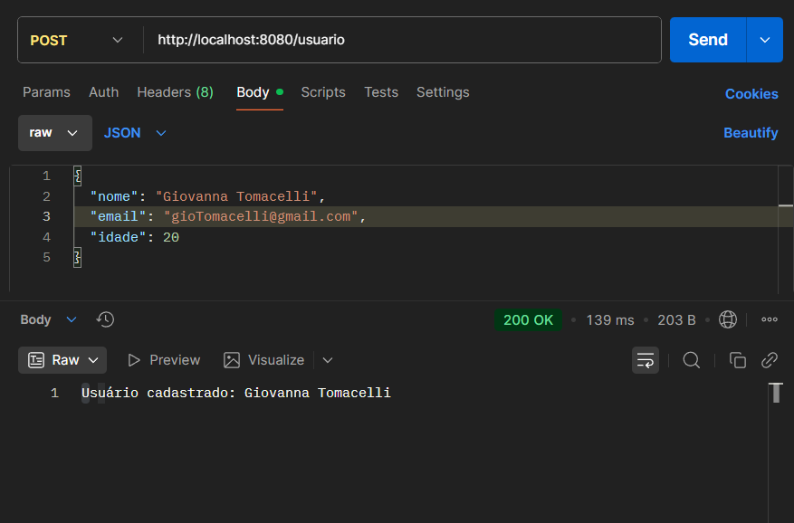
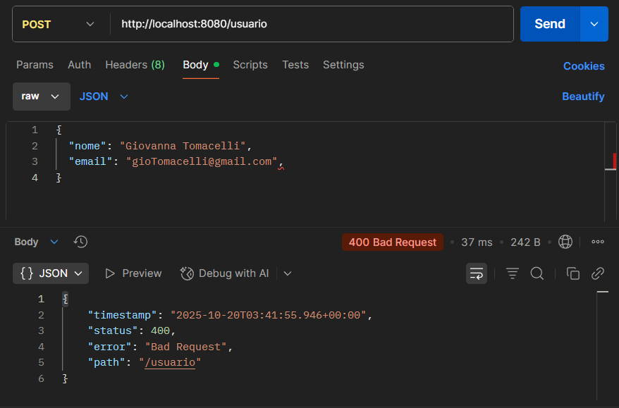

# 🧪 Demo API – Testes de Software com Spring Boot

Este projeto foi desenvolvido para **exercícios práticos de Teste de Software**, utilizando uma **API simples em Java (Spring Boot)**.  
Os testes contemplam **funcionais, exploratórios, de regressão, não funcionais e de carga.**

---

## ⚙️ Tecnologias Utilizadas

- **Java 21**
- **Spring Boot 3.x**
- **Maven**
- **Postman** (para testes manuais)

---

## 🧩 Dependências (Spring Initializr)

Selecione no [start.spring.io](https://start.spring.io/):

- ✅ **Spring Web**
- ✅ **Validation**

---

## 🚀 Como Executar o Projeto

1. Clone ou baixe o projeto.
2. No terminal, na raiz do projeto, execute:

```bash
mvn spring-boot:run
```

3. A aplicação estará disponível em:
```bash
http://localhost:8080
```

## 📁 Estrutura Básica
src/main/java/com/example/demoapi/
├── DemoApiApplication.java
├── controller/
│   ├── CalculadoraController.java
│   ├── UsuarioController.java
│   ├── ProdutoController.java
│   ├── StatusController.java
│   └── LentoController.java
└── model/
└── Usuario.java

## 🧮 1. Teste Funcional
### 🎯 Objetivo

Verificar o comportamento correto dos endpoints /calculadora em operações válidas e inválidas.

### 🔹 Endpoint: /calculadora/multiplicar

Método: GET
Parâmetros: a, b

**Exemplo:**

```bash
GET http://localhost:8080/calculadora/multiplicar?a=5&b=3
```



### 🔹 Endpoint: /calculadora/dividir

Método: GET
Parâmetros: a, b

**Exemplo 1:**
```bash
GET http://localhost:8080/calculadora/dividir?a=10&b=2
```


**Exemplo 2:**
```bash
GET http://localhost:8080/calculadora/dividir?a=10&b=0
```


## 🧭 Teste Exploratório
### 🎯 Objetivo

Observar como a API reage a entradas inválidas e métodos incorretos.

### 🔹 Endpoint: /usuario

Método: POST

**Exemplo de corpo válido:**
```bash
{
  "nome": "Giovanna Tomacelli",
  "email": "gioTomacelli@gmail.com",
  "idade": 20
}
```


**Exemplo de corpo malformado (erro proposital):**
```bash
{
  "nome": "Giovanna Tomacelli",
  "email": "gioTomacelli@gmail.com",
}
```

Comportamento esperado:
➡️ 400 Bad Request — o Spring rejeita o JSON inválido automaticamente.


